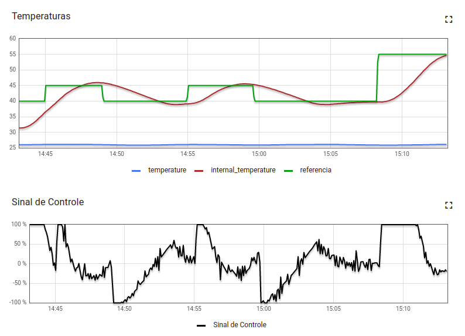
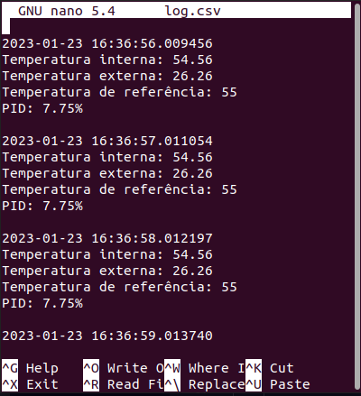

# Fundamentos de Sistemas Embarcados (FSE)
## [Trabalho 2 - 2022/2](https://gitlab.com/fse_fga/trabalhos-2022_2/trabalho-2-2022-2)
</br>

## Dados do Aluno

| Nome | Matrícula  |
| :-: | :-: |
| Lorrayne Alves Cardozo | 19/0032863 |

## Como executar
Após acessar alguma placa, é necessário realizar a instalação de alguns módulos: 

```bash
pip3 install pyserial
pip3 install smbus
pip3 install RPi.bme280
```

Em seguida, entrar na raiz do projeto e executar a main:

```bash
cd src
python3 main.py
```

## Interface



Ao setar uma temperatura de referência maior que a interna pelo botão da dashboard, podemos observar que a temperatura interna começa a subir, assim como o sinal de controle do resistor; da mesma forma, o sinal de controle da ventoinha aumenta quando é setada uma temperatura de referência é menor do que a interna.

### Encerramento do sistema
Ao encerrar o sistema, apertando as teclas `CTRL+C`, o forno será devidamente parado e desligado.

## LOG
O sistema gera um arquivo de log que armazena, a cada 1 segundo, data e horário, as temperaturas interna, ambiente e de referência, e o sinal de controle da resistência e ventoinha. O arquivo pode ser encontrado em `src/log/log.csv`.

